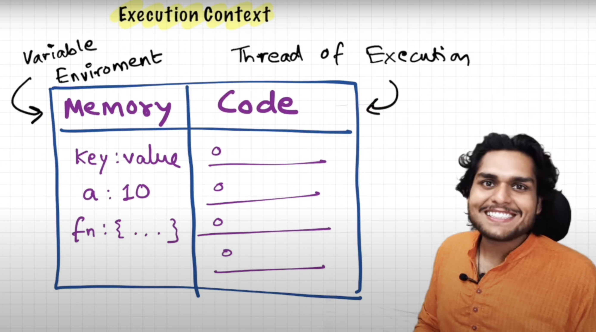
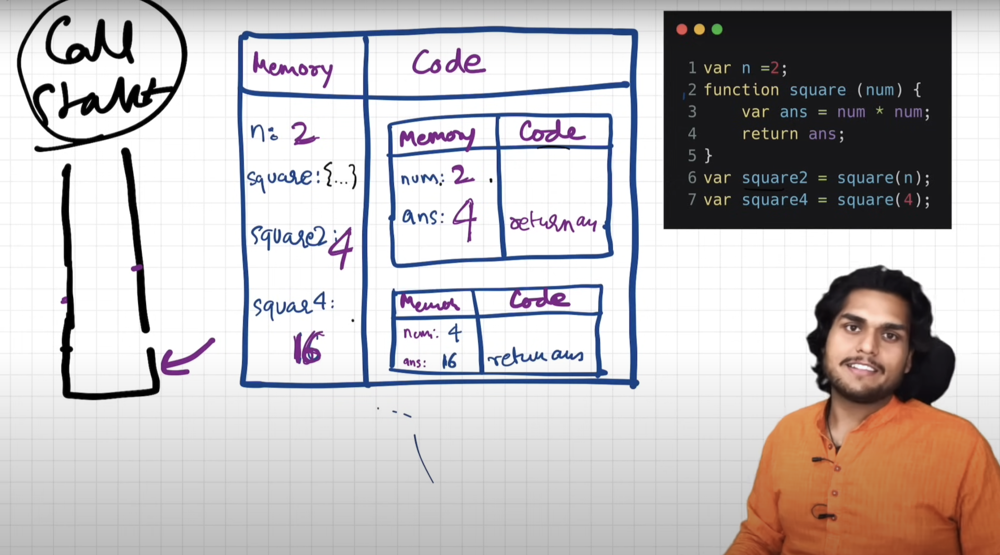
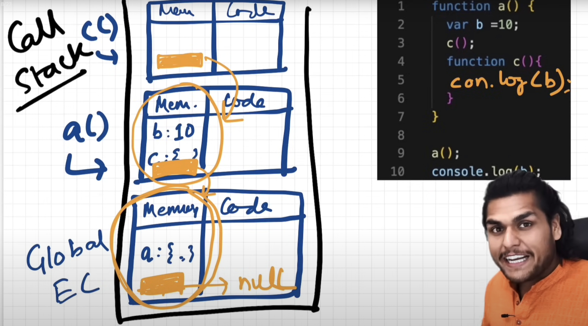
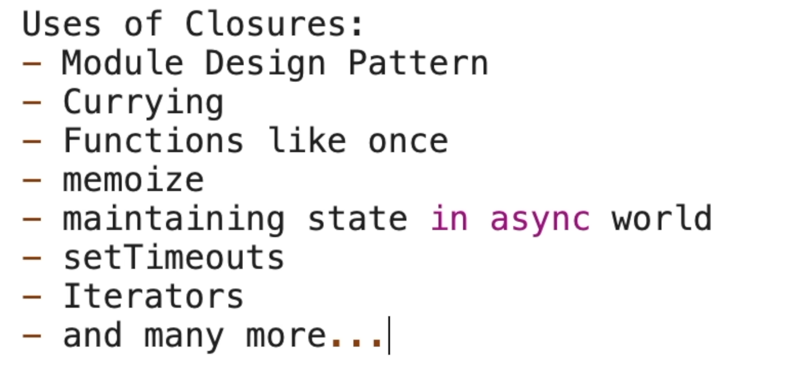
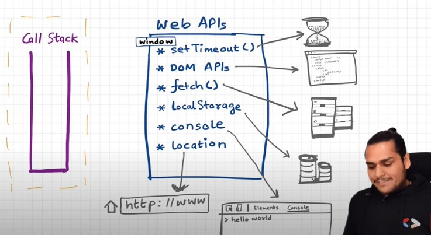

 #### "Everything in JavaScript happens inside an **Execution Context**"
- We can assume this **Execution Context** as a big box or a container in which whole javascript code is executed.

- Execution Context has 2 components/phases in it:
  1. **Memory Component / Memory Creation Phase** - It is the place where all variables and functions are stored as key value pairs. This memory component is also known as **Variable Environment**.
  2. **Code Component / Code Execution Phase** - It is the place where code is executed one line at a time. This code component is also known as **Thread of Execution**.



#### **"JavaScript is a Synchronous Single Threaded Language"**
- So when we say single threaded that means js can only execute one command at a time in a specific order(synchronous).
- If **JavaScript is a Synchronous Single Threaded Language** then how is AJAX or Asynchronous Nature/Operations possible?
  Its due to an concept known as **"Event Loop"**.
---
#### What happens when we run a js program?
- **An Execution Context is created!**
#### So let us now see how this beautiful **execution context** is created with the help of a **JS Program**.



- Whenever a js program is executed a global execution context is created, having 2 phases(memory creation phase & code execution phase) one after the other does their work of running the program.

- Note - Whenever an function invocation(fn call) happens a new execution context is created and pushed into the call stack.

- In the memory creation phase the variables & fn are stored as key value pairs. Variables are assigned(initialized) with special values(placeholder) called undefined. Functions are initialized with their whole function definition(literally whole exact code) as it is!

- In the code execution phase the code is run line-by-line, and actual values are assigned to variables, replacing the undefined placeholder.

- When an function(or the program) work is done(code execution phase is completed) then it is deleted and popped off from the call stack(at last the gec is deleted and the program ends).
#### **Call Stack** maintains the order of execution of execution contexts.
- Call Stack is also known as :-
  1. Execution Context Stack
  2. Program Stack
  3. Control Stack
  4. Runtime Stack
  5. Machine Stack
---
### **Hoisting**
Hoisting is a mechanism that allows you to use variables and functions before they are declared or assigned a value, without getting a ReferenceError. This happens because of the memory creation phase of the Execution Context, which allocates memory for declarations before the code begins to execute.

---

### Shortest JS Program, window & this keyword

The shortest JS program is an empty file because even in that case, the JS engine performs several actions. As usual, it creates the Global Execution Context (GEC), which has a memory space.

The JS engine also creates the 'window' (global object), an object that resides in the global space. It contains numerous functions and variables that can be accessed from anywhere in the program. Additionally, the JS engine creates a 'this' keyword, which points to the window object at the global level. Therefore, along with the GEC, a global object (window) and a 'this' variable are created.

The name of the global object varies among different JS engines. It's called 'window' in browsers but something else in Node.js. At the global level, this === window is always true.

Whenever a global execution context is created, the global object (window in browsers) and the this variable are also created. In a local (functional) execution context, a this variable is also always created.

Any variables/functions created in the global scope gets attached to the global object.

For example:

```js
var x = 10;
console.log(x); // 10
console.log(this.x); // 10
console.log(window.x); // 10
```

---

### undefined vs not defined in JS

In first phase (memory allocation) JS assigns each variable a placeholder called undefined.

undefined is when memory is allocated for the variable, but no value is assigned yet.

If an object/variable is not even declared/found in memory allocation phase, and tried to access it then it is Not defined

Not Defined !== Undefined

When variable is declared but not assigned value, its current value is undefined. But when the variable itself is not declared but called in code, then it is not defined.

```js
console.log(x); // undefined
var x = 25;
console.log(x); // 25
console.log(a); // Uncaught ReferenceError: a is not defined
```

JS is a loosely typed / weakly typed language. It doesn't attach variables to any datatype. We can say var a = 5, and then change the value to boolean a = true or string a = 'hello' later on.
Never assign undefined to a variable manually. Let it happen on it's own accord.

---

### async vs defer attributes

Async and defer are boolean attributes used with `<script>` tags to load external scripts more efficiently on a webpage.

There are three main cases to consider:

1. No attributes
2. The async attribute
3. The defer attribute

When a webpage loads, two main processes occur in the browser: parsing HTML and loading (fetching and executing) scripts.

1. No Attributes
   When a browser encounters a script tag without async or defer, HTML parsing pauses. The browser fetches and executes the script immediately. After the script finishes executing, HTML parsing resumes. This can block rendering and slow down the page's initial load.

2. The async Attribute
   With the async attribute, the browser fetches the script in the background while HTML parsing continues. Once the script is fully fetched, HTML parsing pauses so the script can be executed. After execution, parsing resumes.

A key point is that the execution order of async scripts is not guaranteed. A script that's fetched faster might execute before a script that was declared earlier in the HTML. This is suitable for scripts that are independent of other scripts on the page, like analytics or tracking scripts.

3. The defer Attribute
   The defer attribute also tells the browser to fetch scripts in the background while HTML parsing continues. However, unlike async, scripts with defer are only executed after the HTML document has been fully parsed. They execute in the order in which they appear in the HTML.

The use of defer is generally recommended because it doesn't block HTML parsing and ensures scripts that depend on the HTML structure (like manipulating the DOM) are executed at the appropriate time.


**This table summarizes how the placement and attributes of a `<script>` tag affect when the script loads and executes, and how it impacts the parsing of your HTML document.**

| Placement           | No Attributes                                           | With `async`                                         | With `defer`                                   |
| :------------------ | :------------------------------------------------------ | :--------------------------------------------------- | :--------------------------------------------- |
| **In `<head>`**     | Blocks HTML parsing.                                    | Non-blocking download; pauses parsing for execution. | Non-blocking download; executes after parsing. |
| **End of `<body>`** | Non-blocking to initial render; executes after parsing. | Download starts later than optimal.                  | Redundant; same behavior as no-attribute.      |

**Use `<script defer>` in the `<head>` to download scripts in the background and execute them only after the HTML is ready, a superior method for web performance.**

---

### The Scope Chain, Scope & Lexical Environment

**Scope** means where we can access a specific variable or a function in our code.

Scope in Javascript is directly related to Lexical Environment. Scope is directly depended on the lexical environment.

Whenever an execution context is created an lexical environment is also created.

**Lexical environment** => Local Memory + Reference to Lexical Environment of it's Parent(Lexical Parent{where actually/physically the code is present}).

The term **Lexical** means in hierarchy or in a sequence.

In the global space the lexical environment points to null.



Scope Chain is basically this chain of lexical environments(and its parent references).

---

### let & const in JS, Temporal Dead Zone

let and const declarations are hoisted, but its different from var.

```js
console.log(a); // ReferenceError: Cannot access 'a' before initialization
console.log(b); // prints undefined as expected
let a = 10;
console.log(a); // 10
var b = 15;
console.log(window.a); // undefined
console.log(window.b); // 15
```

It looks like let isn't hoisted, but it is, let's understand:

Both a and b are actually initialized as undefined in hoisting stage. But var b is inside the storage space of GLOBAL, and a is in a separate memory object called script, where it can be accessed only after assigning some value to it first ie. one can access 'a' only if it is assigned. Thus, it throws error.

**Temporal Dead Zone** : Time since when the let/const variable was hoisted until it is initialized some value.

So any line till before "let a = 10" is the TDZ for a.
Since a is not accessible on global, its not accessible in window/this also. window.b or this.b -> 15; But window.a or this.a ->undefined, just like window.x->undefined (x isn't declared anywhere)

The three primary types of errors in js are:

1. **ReferenceError**: This error occurs when you try to access a variable or function that hasn't been declared or is currently in its Temporal Dead Zone.

2. **SyntaxError**: This error is caused by code that violates the grammar of the JavaScript language. The entire script will fail to run if a SyntaxError is encountered. A SyntaxError only happens when the structure of the code itself is invalid like missing brackets, quotes, or using keywords in a way that’s not allowed. For example, if you forget a closing bracket: `if (true { console.log("Hi")` this will throw a SyntaxError. Another example is using a reserved keyword incorrectly: `var let = 5;` this is invalid syntax.

3. **TypeError**: This error happens when an operation is performed on an inappropriate data type, such as trying to reassign a const variable or calling a method on a non-object.

---

### BLOCK SCOPE & Shadowing

- A block is defined by these `{}` curly braces.
- A block is also known as **compound statement**.
- A block is used to combine multiple js statements into one group.
- You might ask we do we need to group multiple js statements together, we need to group these statements together so that we can use multiple js statements togther in a place where js expects only one statement.
  examples(if else, loops, functions etc).

- Block Scope - Block scope means whatever variables and functions we can access inside a block.

#### What is Shadowing?

- The term **shadowing** specifically means that a variable in an inner scope hides a variable with the same name from an outer scope, while both variables co-exist in memory.

```js
var a = 100;
{
  var a = 10; // same name as global var
  let b = 20;
  const c = 30;
  console.log(a); // 10
  console.log(b); // 20
  console.log(c); // 30
}
console.log(a); // 10, instead of the 100 we were expecting. So block "a" modified val of global "a" as well. In console, only b and c are in block space. a initially is in global space(a = 100), and when a = 10 line is run, a is not created in block space, but replaces 100 with 10 in global space itself.
```

- A var declared inside a block with the same name as a global var does not create a new, separate variable. Instead, it re-declares and updates the value of the existing global variable. This is a key difference from let and const, which create a separate, "shadowed" variable within the block's scope.

**Let's observe the behaviour in case of let and const and understand it's reason.**

```js
let b = 100;
{
  var a = 10;
  let b = 20;
  const c = 30;
  console.log(b); // 20
}
console.log(b); // 100, Both b's are in separate spaces (one in Block(20) and one in Script(another arbitrary mem space)(100)). Same is also true for *const* declarations.
```

**Same logic is true even for functions**

```js
const c = 100;
function x() {
  const c = 10;
  console.log(c); // 10
}
x();
console.log(c); // 100
```

**What is Illegal Shadowing?**

```js
let a = 20;
{
  var a = 20;
}
// Uncaught SyntaxError: Identifier 'a' has already been declared
```

- We cannot shadow let with var. But it is valid to shadow a let using a let. However, we can shadow var with let.

- All scope rules that work in function are same in arrow functions too.

**Since var is function scoped, it is not a problem with the code below.**

```js
let a = 20;
function x() {
  var a = 20;
}
```

---

### Closures

Function bundled with its lexical environment is known as a **_closure_**.

or

Function along with it's lexical scope forms a closure.

A closure is a powerful feature in JavaScript where a function remembers and has access to its lexical scope the variables of its parent function even after that parent function has finished executing.

Think of it as a function being "bundled" together with the environment it was created in. When you return a function from another function, you're not just returning the function itself, but the entire closure. This allows the returned function to "remember" and access variables that would normally be garbage-collected.

```js
function x() {
  let a = 5;
  return function () {
    console.log(a);
  };
}

let ans = x();
ans();
```

**Advantages of Closures**



- Data Privacy / Data Hiding / Encapsulation
```js
// closure application - data privacy also known as encapsulation
function close() {
  let count = 0;

  function incrementCount() {
    count++;
    console.log(count);
  }
  return incrementCount;
}

let counter1 = close()
counter1()
counter1()
counter1()

let counter2 = close()
counter2()
counter2()
counter2()
counter2()
```

- Adhoc from above example
```js
// Constructor function to create a counter object with private variable 'count', and methods to increment and decrement the count.
// The 'count' variable is not accessible from outside the function, ensuring encapsulation and data privacy.
// Constructor functions are what we use to create objects in JavaScript before the introduction of ES6 classes. They allow us to define properties and methods that will be shared by all instances of the object created using the constructor.
function Count(){
  let count = 0;
  this.increment = function(){
    count++;
    console.log(count);
  }
  this.decrement = function(){
    count--;
    console.log(count);
  }
}

const counter = new Count();
counter.increment(); // 1
counter.increment(); // 2
counter.decrement(); // 1
counter.decrement(); // 0
```

- Currying: Currying is the transformation of a function with multiple arguments into a sequence of nested functions, each taking a single argument. It's used for partial application, which creates new, reusable functions by pre-filling some arguments, and for function composition, making it easier to chain functions together.

```html
<!DOCTYPE html>
<html lang="en">
  <head>
    <meta charset="UTF-8" />
    <meta name="viewport" content="width=device-width, initial-scale=1.0" />
    <title>Currying</title>
  </head>
  <body>
    <script>
      function sendAutomatedEmail(to) {
        return function (subject) {
          return function (body) {
            console.log(
              `Sending email to ${to} with subject "${subject}" and body "${body}"`
            );
          };
        };
      }
      sendAutomatedEmail("example@example.com")("Hello World")(
        "This is a test email."
      );
    </script>
  </body>
</html>
```

- Memoization: It allows a function to cache results and avoid recalculating them.

```html
<!DOCTYPE html>
<html lang="en">
  <head>
    <meta charset="UTF-8" />
    <meta name="viewport" content="width=device-width, initial-scale=1.0" />
    <title>Memoization</title>
  </head>
  <body>
    <script>
      function getMemoizedExpensiveCalculation() {
        const cache = {};
        return function expensiveCalcultation(n) {
          if (cache[n]) return cache[n];
          let sum = 0;
          for (let i = 0; i <= n; i++) {
            console.log(`Calculating...${i}`);
            sum += i;
          }
          cache[n] = sum;
          return sum;
        };
      }

      const memoizedExpensiveCalcultation = getMemoizedExpensiveCalculation();
      const result = memoizedExpensiveCalcultation(5);
      console.log(result);
    </script>
  </body>
</html>
```

- setTimeouts: It ensures that an asynchronous function has access to variables from its parent scope when it finally executes.
- Module Pattern
- Function that can be called just once

**Disadvantages of Closures**

- Over-consumption of Memory: Since closures hold onto their parent's scope, they can lead to increased memory usage.

- Memory Leaks: If not managed correctly, closures can prevent the garbage collector from freeing up memory, leading to leaks.

- Freezing the Browser: A severe memory leak caused by closures can slow down or completely freeze the browser's performance.

---

### Function Composition

Function composition is the process of combining two or more functions into a single function.(it is also an application of currying)

```html
<!DOCTYPE html>
<html lang="en">
  <head>
    <meta charset="UTF-8" />
    <meta name="viewport" content="width=device-width, initial-scale=1.0" />
    <title>Function Composition</title>
  </head>
  <body>
    <script>
      // currying concept(internally closures)
      function add(x) {
        return function (y) {
          return x + y;
        };
      }

      const add3 = add(3);

      function multiply(x) {
        return x * x;
      }

      // function composition
      function add3AndMultipy(fn1, fn2) {
        return function (value) {
          return fn2(fn1(value));
        };
      }

      const compose = add3AndMultipy(add3, multiply);
      const result = compose(5);
      console.log(result);
    </script>
  </body>
</html>
```

### Function Statements, Function Declarations, Function Expressions, Anonymous Functions, Anonymous Function Expressions, Named Function Expressions, Arguments vs Parameters, First-Class Functions/First-Class Citizens, Arrow Functions

```js
// Function Statement also known as Function Declaration (means the function is defined with the function keyword)
function greet() {
  console.log("Hello, World!");
}

// Function Expression (means the function is stored in a variable) also known as Anonymous Function Expression
const farewell = function () {
  console.log("Goodbye, World!");
};

/* 
Difference between Function Statement / Function Declaration and Function Expression

Hoisting: Function declarations are hoisted, meaning they can be called before they are defined. Function expressions are not hoisted.
greet(); // Works
farewell(); // Uncaught ReferenceError: Cannot access 'farewell' before initialization
*/

// Anonymous Function (a function without a name, often used as an argument to other functions or assigned to variables)
setTimeout(function () {
  console.log("This is an anonymous function");
}, 1000);

// Named Function Expression (a function expression with a name, useful for recursion or debugging)
const factorial = function fact(n) {
  if (n <= 1) return 1;
  return n * fact(n - 1);
};

/*
Arguments vs Parameters

- Parameters are the names listed in the function definition.
- Arguments are the real values passed to the function when it is invoked.

Example:
function add(a, b) { // a and b are parameters
  return a + b;
}

add(2, 3); // 2 and 3 are arguments
*/

/*
First-Class Functions/First-Class Citizens

In JavaScript, functions are first-class citizens, meaning they can be treated like any other variable. They can be:

1. Assigned to variables
2. Passed as arguments to other functions
3. Returned from other functions
4. Stored in data structures like arrays or objects
*/

// Arrow Function (means a shorter and newer syntax for writing function expressions and functions in general. mostly used in modern JavaScript)
const shout = () => {
  console.log("Hey there!");
};
```

home work : pure functions

---

### Callback Functions

Functions are first class citizens ie. take a function A and pass it to another function B. Here, A is a callback function. So basically I am giving access to function B to call function A. This callback function gives us the access to whole Asynchronous world in Synchronous world.

```js
setTimeout(function () {
  console.log("Timer");
}, 1000); // first argument is callback function and second is timer.
```

JS is a synchronous and single threaded language. But due to callbacks, we can do async things in JS.

## **(IMP)** Garbage Collection and removeEventListeners

Event listeners are heavy as they form closures. So even when call stack is empty, EventListener won't free up memory allocated to count as it doesn't know when it may need count again.

So we remove event listeners when we don't need them (garbage collected) onClick, onHover, onScroll all in a page can slow it down heavily.

---

### Event Loop




#### What enters the Microtask Queue ?

- All the callback functions that come through promises go in microtask Queue.
- **Mutation Observer** : A **_MutationObserver_** is a built-in JS object that watches for mutations in the DOM tree. It efficiently batches all detected changes and then schedules a callback function to run by placing it in the microtask queue.
- Callback functions that come through **_promises_** and **_mutation observer_** go inside **_Microtask Queue_**. All the rest goes inside **Callback Queue** aka. **Task Queue**.
- If the task in microtask Queue keeps creating new tasks in the queue, element in callback queue never gets chance to be run. This is called **starvation**.

---

- JS runs literally everywhere, from smartwatches to robots to browsers, because of the JavaScript Runtime Environment (JRE).
- JRE is like a big container that has everything required to run JavaScript code.
- JRE consists of a JS Engine (❤️ of JRE), a set of APIs to connect with the outside environment, an Event Loop, Callback Queue, Microtask Queue, etc.
- Browsers can execute JavaScript code because they have a JavaScript Runtime Environment.
- ECMAScript is a governing body of JS. It has a set of rules that are followed by all JS engines like Chakra (Internet Explorer), SpiderMonkey (Firefox) (the first JavaScript engine created by the JS creator himself), and V8 (Chrome).
- A JavaScript Engine is not a machine. It is software written in low-level languages (e.g., C++) that takes high-level JavaScript code and spits out low-level machine code.

- Code inside the JavaScript Engine passes through 3 steps: **Parsing**, **Compilation**, and **Execution**.
    1. **Parsing** - Code is broken down into tokens. In `let a = 7`, `let`, `a`, `=`, and `7` are all tokens. We also have a Syntax Parser that takes the code and converts it into an AST (Abstract Syntax Tree), which is a JSON-like structure with keys such as type, start, end, body, etc. (Looks like package.json but for a line of JavaScript code. Kinda unimportant.) Check out astexplorer.net -  it converts a line of code into an AST.
    2. **Compilation** - JS has something called Just-In-Time (JIT) Compilation, which uses both an interpreter and a compiler. Compilation and execution go hand in hand. The AST from the previous step goes to the interpreter, which converts high-level code into bytecode and moves it to execution. While interpreting, the compiler also works hand in hand to compile and create optimized code during runtime. **Does JavaScript really compile?** The answer is a loud **YES**. JS used to be only interpreted in older times, but now it both compiles and interprets code, making it a JIT-compiled language. It's like the best of both worlds.
    3. **Execution** - This needs 2 components: the Memory Heap (the place where all memory is stored) and the Call Stack (the same Call Stack from previous episodes). There is also a Garbage Collector. It uses an algorithm called **Mark and Sweep**.
    

- v8 of Google has Interpreter called Ignition, a compiler called Turbo Fan and garbage collector called Orinoco. 
- v8 architecture :-

  

(Read about oilpan garbage collector, read about mark and sweep algorithm, inlining, copy elison, inline caching)

---
# setTimeout and JavaScript Concurrency Model
- `setTimeout` with a timer of 5 seconds does **not guarantee** that the callback function will execute **exactly after 5 seconds**.
## Example
```js
console.log("Start");

setTimeout(function cb() {
  console.log("Callback");
}, 5000);

console.log("End");

// Millions of lines of code to execute
```
### Possible Output
```txt
Start
End
Callback
```

The callback may run after **5s, 6s, 7s, 10s, or even later**, depending on whether the Call Stack is free.
## Why?
- First, the **Global Execution Context (GEC)** is created and pushed into the Call Stack.
- `"Start"` is printed.
- When `setTimeout` is encountered:
    - The callback function is registered in the browser's **Web APIs**.
    - A timer of 5 seconds starts.    
    - JavaScript does **not wait** and moves to the next line.
- `"End"` is printed.
- Suppose there are millions of lines of code after this, taking **10 seconds** to execute.
- During this time, the timer completes in the background after 5 seconds.
- The callback function is moved to the **Callback Queue**.
- However, it cannot execute yet because the **Call Stack is still busy** executing the remaining code.
- The **Event Loop** continuously checks whether the Call Stack is empty.
- Once the GEC finishes and the Call Stack becomes empty (after 10 seconds), the callback is moved from the Callback Queue to the Call Stack and gets executed.
    
> Even though the timer was 5 seconds, the callback waited until the Call Stack became empty.

This behavior is part of JavaScript's **Concurrency Model** and explains why `setTimeout` is not always trustworthy for exact timing.

---

## Important Rule
> Do not block the main thread.

JavaScript is a **single-threaded language** with only one Call Stack. If the main thread is busy, callbacks must wait.

---
## Key Point
`setTimeout` guarantees:
> The callback will run **after at least** the specified delay.

It does **not guarantee** execution exactly at that time.

---

## JavaScript Nature
- JavaScript is **synchronous** and **single-threaded**.
- It executes one task at a time.
- Through Web APIs, Callback Queues, and the Event Loop, it can also handle asynchronous operations.
- Modern JavaScript engines use **JIT (Just-In-Time) Compilation** to execute code efficiently.
---
# What if `timeout = 0`?
```js
console.log("Start");

setTimeout(function cb() {
  console.log("Callback");
}, 0);

console.log("End");
```
### Output
```txt
Start
End
Callback
```
### Why?
- Even with a delay of `0ms`, the callback still goes through:
    - Web APIs    
    - Callback Queue
    - Event Loop
- The callback can execute only when the Call Stack becomes empty.    
### Use Case
Using `setTimeout(..., 0)` is a way to **defer a less important task** so that more important synchronous code can finish first.
In this example, `"End"` gets printed before the callback executes.

---
# Higher-Order Functions ft. Functional Programming

**Q: What is a Higher-Order Function?**  
**Ans:** A higher-order function is a regular function that takes other functions as arguments or returns functions as its result. 

For example:
```js
function x() {
    console.log("Hi");
}

function y(x) {
    x();
}

y(x); // Hi

// y is a higher-order function
// x is a callback function
```

Let us try to understand how we should approach the solution in an interview. I have an array of radii, and I have to calculate the area using these radii and store it in an array.
## First Approach
```js
const radius = [1, 2, 3, 4];

const calculateArea = function (radius) {
  const output = [];

  for (let i = 0; i < radius.length; i++) {
    output.push(Math.PI * radius[i] * radius[i]);
  }

  return output;
};

console.log(calculateArea(radius));
```

The above solution works perfectly fine, but what if we now have a requirement to calculate an array of circumferences? 

The code would now look like this:
```js
const radius = [1, 2, 3, 4];

const calculateCircumference = function (radius) {
  const output = [];

  for (let i = 0; i < radius.length; i++) {
    output.push(2 * Math.PI * radius[i]);
  }

  return output;
};

console.log(calculateCircumference(radius));
```

But over here, we are violating a principle like the DRY principle. Now let us observe a better approach.
```js
const radiusArr = [1, 2, 3, 4];

// logic to calculate area
const area = function (radius) {
    return Math.PI * radius * radius;
};

// logic to calculate circumference
const circumference = function (radius) {
    return 2 * Math.PI * radius;
};

const calculate = function (radiusArr, operation) {
    const output = [];

    for (let i = 0; i < radiusArr.length; i++) {
        output.push(operation(radiusArr[i]));
    }

    return output;
};

console.log(calculate(radiusArr, area));
console.log(calculate(radiusArr, circumference));

// Over here, calculate is a HOF.
// Over here, we have extracted the logic into separate functions.
// This is the beauty of functional programming.
```
## Polyfill of map
Over here, `calculate` is nothing but a polyfill of the `map` function.
```js
// console.log(radiusArr.map(area)) === console.log(calculate(radiusArr, area));
```

---

Let us convert the above `calculate` function into a `map` function and try to use it.
```js
Array.prototype.calculate = function (operation) {
    const output = [];

    for (let i = 0; i < this.length; i++) {
        output.push(operation(this[i]));
    }

    return output;
};

console.log(radiusArr.calculate(area));
```

Hw: search about prototype and prototypal inheritance.

---

# map, filter & reduce
`map`, `filter`, and `reduce` are higher-order functions.
## map Function
It is basically used to transform an array. The `map()` method creates a new array with the results of calling a function for every array element.

```js
const output = arr.map(function);
```

This function tells `map` what transformation we want on each element of the array.

```js
const arr = [5, 1, 3, 2, 6];

// Task 1: Double the array elements: [10, 2, 6, 4, 12]

function double(x) {
  return x * 2;
}

const doubleArr = arr.map(double);

// Internally, map will run the double function for each element
// of the array, create a new array, and return it.

console.log(doubleArr); // [10, 2, 6, 4, 12]
```

### Task 2: Triple the array elements
```js
const arr = [5, 1, 3, 2, 6];

// Transformation logic
function triple(x) {
  return x * 3;
}

const tripleArr = arr.map(triple);

console.log(tripleArr); // [15, 3, 9, 6, 18]
```

### Task 3: Convert array elements to binary
```js
const arr = [5, 1, 3, 2, 6];

// Transformation logic
function binary(x) {
  return x.toString(2);
}

const binaryArr = arr.map(binary);
```

The above code can be rewritten as:
```js
const binaryArr = arr.map(function binary(x) {
  return x.toString(2);
});
```

OR using an arrow function:
```js
const binaryArr = arr.map((x) => x.toString(2));
```

So basically, the `map` function maps each and every value and transforms it based on the given logic.

---

## filter Function
The `filter` function is basically used to filter values inside an array. The `arr.filter()` method is used to create a new array from a given array consisting only of those elements that satisfy a condition set by the callback function.

```js
const array = [5, 1, 3, 2, 6];

// Filter odd values
function isOdd(x) {
  return x % 2;
}

const oddArr = array.filter(isOdd);

console.log(oddArr); // [5, 1, 3]
```

Another way of writing the above:
```js
const oddArr = array.filter((x) => x % 2);
```

The `filter` function creates a new array and stores only those values that evaluate to `true`.

---

## reduce Function
It is a function that takes all the values of an array and gives a single output. It reduces the array to a single value.

```js
const array = [5, 1, 3, 2, 6];

// Calculate the sum of elements of an array - Non-functional programming way

function findSum(arr) {
  let sum = 0;

  for (let i = 0; i < arr.length; i++) {
    sum = sum + arr[i];
  }

  return sum;
}

console.log(findSum(array)); // 17
```

### reduce Function Way
```js
const sumOfElem = array.reduce(function (accumulator, current) {

  // current represents the current value of the array

  // accumulator is used to store the accumulated result

  // Compared to the previous code snippet,
  // sum is the accumulator and arr[i] is the current value

  accumulator = accumulator + current;

  return accumulator;

}, 0);

// In the above example, sum was initialized with 0,
// so over here accumulator also needs to be initialized.
// The second argument to reduce represents the initial value.

console.log(sumOfElem); // 17
```

### Find Maximum Inside an Array - Non-functional Programming Way
```js
const array = [5, 1, 3, 2, 6];

function findMax(arr) {
  let max = 0;

  for (let i = 0; i < arr.length; i++) {
    if (arr[i] > max) {
      max = arr[i];
    }
  }

  return max;
}

console.log(findMax(array)); // 6
```

### Using reduce
```js
const output = array.reduce((acc, current) => {

  if (current > acc) {
    acc = current;
  }

  return acc;

}, 0);

console.log(output); // 6
```

`acc` is just a label that represents the accumulated value so far, so we can also label it as `max` in this case.

```js
const output = array.reduce((max, current) => {

  if (current > max) {
    max = current;
  }

  return max;

}, 0);

console.log(output); // 6
```

---

# Tricky map
```js
const users = [
  { firstName: "Alok", lastName: "Raj", age: 23 },
  { firstName: "Ashish", lastName: "Kumar", age: 29 },
  { firstName: "Ankit", lastName: "Roy", age: 29 },
  { firstName: "Pranav", lastName: "Mukherjee", age: 50 },
];
```

### Get an array of full names
```js
// ["Alok Raj", "Ashish Kumar", ...]

const fullNameArr = users.map(
  (user) => user.firstName + " " + user.lastName
);

console.log(fullNameArr);
```

---

### Get the count/report of people by age
```js
// Output:
// { 23: 1, 29: 2, 50: 1 }

// We should use reduce because we want to derive
// some information from the array.
// Basically, we want to get a single object as output.

const report = users.reduce((acc, curr) => {

  if (acc[curr.age]) {
    acc[curr.age] = ++acc[curr.age];
  } else {
    acc[curr.age] = 1;
  }

  return acc; // Return the updated object every time

}, {});

console.log(report); // { 23: 1, 29: 2, 50: 1 }
```

---

# Function Chaining

### First names of all people whose age is less than 30
```js
const users = [
  { firstName: "Alok", lastName: "Raj", age: 23 },
  { firstName: "Ashish", lastName: "Kumar", age: 29 },
  { firstName: "Ankit", lastName: "Roy", age: 29 },
  { firstName: "Pranav", lastName: "Mukherjee", age: 50 },
];

// Function chaining

const output = users
  .filter((user) => user.age < 30)
  .map((user) => user.firstName);

console.log(output); // ["Alok", "Ashish", "Ankit"]
```

### Homework Challenge
Implement the same logic using `reduce`.

```js
const output = users.reduce((acc, curr) => {

  if (curr.age < 30) {
    acc.push(curr.firstName);
  }

  return acc;

}, []);

console.log(output); // ["Alok", "Ashish", "Ankit"]
```

---
# Callback

There are 2 parts of Callback:
### Good Part of Callback
Callbacks are super important while writing asynchronous code in JavaScript.
### Bad Part of Callback
Using callbacks, we can face issues such as:
- Callback Hell
- Inversion of Control

Understanding the bad part of callbacks is super important to learn Promises in the next lecture.

---

💡 JavaScript is a synchronous, single-threaded language. It can do only one thing at a time. It has just one call stack, and it can execute one thing at a time. Whatever code we give to JavaScript will be quickly executed by the JavaScript engine; it does not wait.

```js
console.log("Namaste");
console.log("JavaScript");
console.log("Season 2");

// Namaste
// JavaScript
// Season 2
```

💡 It is printing quickly because **"Time, tide & JavaScript wait for none."**

But what if we have to delay the execution of a line? We could utilize a callback. How?

```js
console.log("Namaste");

setTimeout(function () {
  console.log("JavaScript");
}, 5000);

console.log("Season 2");

// Namaste
// Season 2
// JavaScript
```

💡 Here, we are delaying the execution using the callback approach of `setTimeout`.

---

# 🛒 e-Commerce Web App Situation

Assume a scenario in an e-Commerce web app where a user is placing an order. The user has added items like shoes, pants, and a kurta to the cart and is now placing the order.

So in the backend, the situation could look something like this:
```js
const cart = ["shoes", "pants", "kurta"];

// Two steps to place an order

// 1. Create an order
// 2. Proceed to payment

api.createOrder();
api.proceedToPayment();
```

Assume that once an order is created, only then can we proceed to payment. So there is a dependency. How do we manage this dependency?

A callback can come to the rescue. How?

```js
api.createOrder(cart, function () {
  api.proceedToPayment();
});
```

💡 Over here, the `createOrder` API first creates an order, and then it is responsible for calling `api.proceedToPayment()` as part of the callback approach.

---

To make it a bit more complicated, what if after the payment is done, we have to show the order summary by calling `api.showOrderSummary()`?

Now it has a dependency on `api.proceedToPayment()`.

Our code would look something like this:
```js
api.createOrder(cart, function () {
  api.proceedToPayment(function () {
    api.showOrderSummary();
  });
});
```

Now what if we also have to update the wallet? This would have a dependency on `showOrderSummary()`.

```js
api.createOrder(cart, function () {
  api.proceedToPayment(function () {
    api.showOrderSummary(function () {
      api.updateWallet();
    });
  });
});
```

---

# 💡 Callback Hell

When we have a large codebase, multiple APIs, and dependencies on each other, we fall into callback hell.

These code structures are tough to maintain.

This callback hell structure is also known as the **Pyramid of Doom**.

---

Till this point, we are comfortable with the concept of callback hell, but now let us discuss **Inversion of Control**.

It is very important to understand this in order to get comfortable with the concept of Promises.

💡 Inversion of Control means that we lose control of our code when we use callbacks.

Let us understand this with the help of an example:
```js
api.createOrder(cart, function () {
  api.proceedToPayment();
});
```

💡 Over here, we are creating an order and then blindly trusting `createOrder` to call `proceedToPayment`.

💡 This is risky because `proceedToPayment` is an important part of the code, and we are blindly trusting `createOrder` to call and handle it.

💡 When we pass a function as a callback, we become dependent on the parent function because it is now responsible for running that callback function.

This is called **Inversion of Control** because we are dependent on that function.

What if the parent function stops working?

What if it was developed by another programmer?

What if the callback runs twice?

What if it never runs at all?

💡 In the next session, we will see how we can fix such problems.

---

💡 Callbacks are one of the foundations of asynchronous programming in JavaScript.

More at: [http://callbackhell.com/](http://callbackhell.com/)

---
# Promises
Promises are used to handle asynchronous operations in JavaScript.

We will discuss, with a code example, how things used to work before Promises and then how they work after Promises.

Suppose we take an example of an e-Commerce application.

```js
const cart = ["shoes", "pants", "kurta"];

// Below two functions are asynchronous and dependent on each other

const orderId = createOrder(cart);
proceedToPayment(orderId);
```

## With Callback (Before Promises)

Below, it is the responsibility of the `createOrder` function to first create the order and then call the callback function.

```js
createOrder(cart, function () {
  proceedToPayment(orderId);
});
```

The above approach has the issue of **Inversion of Control**.

### Q: How do we fix the above issue?

### A: Using Promises.

Now, we will make the `createOrder` function return a Promise, and we will capture that Promise into a variable.

A Promise can be thought of as an object that will eventually contain the result of an asynchronous operation.

Since `createOrder` is an asynchronous function, we do not know how much time it will take to finish execution.

So, the moment `createOrder` gets executed, it immediately returns a Promise object. Initially, the Promise is in a pending state. Let's say that after 5 seconds the execution finishes and the `orderId` is ready. At that point, the Promise gets fulfilled with the `orderId`.

In short, when `createOrder` gets executed, it immediately returns a Promise object. Then JavaScript continues executing the remaining lines of code. After some time, when `createOrder` has finished execution and the `orderId` is ready, the Promise gets fulfilled with that value.

### Q: How will we know when the response is ready?

### A: We attach a callback function to the Promise object using `.then()`. It gets triggered automatically when the result is ready.

```js
const cart = ["shoes", "pants", "kurta"];

const promiseRef = createOrder(cart);

// this promiseRef has access to .then()

// Promise { <pending> }

// Initially, the Promise is pending, so the below callback will not execute.

// After some time, when execution has finished and promiseRef has the data,
// the below callback will automatically get triggered.

promiseRef.then(function (orderId) {
  proceedToPayment(orderId);
});
```

### Q: How is it better than the callback approach?

In the earlier solution, we passed a function and trusted another function to execute that callback.

But with Promises, we are attaching a callback function to a Promise object.

There is a difference between **passing a function** and **attaching a function**.

A Promise guarantees that it will call the attached function once the Promise is fulfilled with data. It will call it only once.

Earlier, we said that Promises are objects with empty data, but that is not entirely true. Promises are much more than that.

---

## Understanding a Real Promise Object

`fetch` is a Web API that is used to make API calls, and it returns a Promise.

We will call a public GitHub API to fetch data.

```js
const URL = "https://api.github.com/users/alok722";

const user = fetch(URL);

// user above will be a Promise.

console.log(user); // Promise { <pending> }
```

### OBSERVATIONS
If we inspect the Promise object in the browser:
- It has an internal state.
- It has an internal result.
- Initially, the Promise result is not available.
- Once the API call completes, the Promise result stores the returned data.
- The Promise state tells us the current status of the Promise.
- Initially, it is in the `pending` state.
- Later, it becomes `fulfilled` or `rejected`.
    
When the above line is executed, `fetch()` makes an API call and instantly returns a Promise in the `pending` state.

JavaScript does not wait for it to become fulfilled.

The next line executes immediately and logs the pending Promise.

**Note:** Chrome DevTools has a small inconsistency. At the moment of logging, the Promise may be pending, but if you expand it later, it may show the fulfilled value because Chrome updates the displayed object after the Promise settles.

Once fulfilled, the response data is available. The response body is typically provided as a `ReadableStream`, and there are methods to extract the actual data.

---

## Attaching a Callback to a Promise
Using `.then()`:
```js
const URL = "https://api.github.com/users/alok722";

const user = fetch(URL);

user.then(function (data) {
  console.log(data);
});
```

And this is how Promises are used.

A Promise can be settled only once, either as a success or a failure.

A Promise is in one of these states:
```txt
pending   : Initial state, neither fulfilled nor rejected.
fulfilled : The operation completed successfully.
rejected  : The operation failed.
```

---

## 💡 Promise Objects Are Immutable
Once a Promise is settled, its state cannot be changed again.

That is why we can safely pass Promise references around without worrying that someone will change the Promise's state.

To access the resolved value, we use `.then()`.

---

# Interview Guide

### 💡 What is a Promise?
- A Promise object is a placeholder for a value that will be available in the future after an asynchronous operation completes.
- A container for a future value.
- A Promise is an object representing the eventual completion or failure of an asynchronous operation.
    

---

We have now solved one issue of callbacks, i.e. **Inversion of Control**.

But there is one more issue:

## Callback Hell

```js
createOrder(cart, function (orderId) {
  proceedToPayment(orderId, function (paymentInfo) {
    showOrderSummary(paymentInfo, function (balance) {
      updateWalletBalance(balance);
    });
  });
});
```

The above code keeps expanding horizontally, creating what is known as the **Pyramid of Doom**.

Callback Hell is ugly and hard to maintain.

---

## 💡 Promises Fix This Too Using Promise Chaining

Example:
```js
createOrder(cart)
  .then(function (orderId) {
    return proceedToPayment(orderId);
  })
  .then(function (paymentInfo) {
    return showOrderSummary(paymentInfo);
  })
  .then(function (balance) {
    return updateWalletBalance(balance);
  });
```

---

## ⚠️ Common Pitfall

We forget to return the Promise in Promise Chaining.

The idea is that the Promise/data returned from one `.then()` becomes the input for the next `.then()`.

So:
```js
createOrder(cart)
  .then(function (orderId) {
    return proceedToPayment(orderId);
  })
  .then(function (paymentInfo) {
    return showOrderSummary(paymentInfo);
  })
  .then(function (balance) {
    return updateWalletBalance(balance);
  });
```

To improve readability, you can use arrow functions instead of regular functions.

---

# Creating a Promise, Chaining & Error Handling

```js
const cart = ["shoes", "pants", "kurta"];

// Consumer part of Promise

const promise = createOrder(cart); // orderId

// Our expectation is that the above function is going to return a Promise.

promise.then(function (orderId) {
  proceedToPayment(orderId);
});
```

The above snippet was already discussed in the previous lecture.

Now we will see how `createOrder` is implemented so that it returns a Promise.

In short, we will see **"How we can create a Promise"** and then return it.

---

## Producer Part of a Promise

```js
function createOrder(cart) {

  // JavaScript provides a Promise constructor through which we can create a Promise.

  // It accepts a callback function with two parameters: `resolve` and `reject`.

  const promise = new Promise(function (resolve, reject) {

    // What are `resolve` and `reject`?

    // These are functions provided by JavaScript to handle the success and failure of an asynchronous operation.

    // Now we will write the logic for `createOrder`.

    /**
     * Mock logic steps:
     * 1. validateCart
     * 2. Insert into DB and get an orderId
     */

    // We are assuming that, in a real-world scenario,
    // validateCart would already be defined.

    if (!validateCart(cart)) {

      // If the cart is not valid, reject the Promise.

      const err = new Error("Cart is not Valid");

      reject(err);
    }

    const orderId = "12345"; // We got this id from the DB (Assumption)

    if (orderId) {

      // Success scenario

      resolve(orderId);
    }
  });

  return promise;
}
```

In the above example, if `validateCart()` returns `true`, the Promise will be resolved successfully.

---

```js
const cart = ["shoes", "pants", "kurta"];

const promise = createOrder(cart); // orderId

// ❓ What will be printed in the below line?

console.log(promise);

promise.then(function (orderId) {
  proceedToPayment(orderId);
});

function createOrder(cart) {
  const promise = new Promise(function (resolve, reject) {

    if (!validateCart(cart)) {
      const err = new Error("Cart is not Valid");
      reject(err);
    }

    const orderId = "12345";

    if (orderId) {
      resolve(orderId);
    }
  });

  return promise;
}
```

### What gets printed?

The Promise may initially appear as:

```js
Promise { <pending> }
```

Why?

Because `createOrder()` may take some time to complete its work, so the Promise starts in the `pending` state.

Once the Promise gets resolved, the callback attached through `.then()` will be executed.

---

## Handling Errors

Now let us see what happens if there is an error and the Promise gets rejected.

We can catch the error using `.catch()`.

```js
const cart = ["shoes", "pants", "kurta"];

const promise = createOrder(cart);

// Here we are consuming the Promise
// and handling Promise errors.

promise
  .then(function (orderId) {

    // ✅ Success / fulfilled Promise handling

    proceedToPayment(orderId);

  })
  .catch(function (err) {

    // ⚠️ Failure / rejected Promise handling

    console.log(err);

  });
```

### Promise Creation

```js
function createOrder(cart) {

  const promise = new Promise(function (resolve, reject) {

    // Assume validateCart returns false.
    // Then the Promise will be rejected.

    if (!validateCart(cart)) {

      const err = new Error("Cart is not Valid");

      reject(err);
    }

    const orderId = "12345";

    if (orderId) {
      resolve(orderId);
    }
  });

  return promise;
}
```

---

# Promise Chaining

Let us understand the concept of Promise Chaining.

- We will assume that after `createOrder()` we have to invoke `proceedToPayment()`.
- In Promise Chaining, whatever is returned from one `.then()` becomes the input for the next `.then()`.
- At any point in the chain, if a Promise gets rejected, the execution jumps to the nearest `.catch()`.
    

```js
const cart = ["shoes", "pants", "kurta"];

createOrder(cart)

  .then(function (orderId) {

    // ✅ Success / fulfilled Promise handling

    // 💡 We return data or a Promise
    // so that chaining can continue.

    console.log(orderId);

    return orderId;

  })

  .then(function (orderId) {

    // Promise Chaining

    // 💡 We will make sure that
    // proceedToPayment returns a Promise too.

    return proceedToPayment(orderId);

  })

  .then(function (paymentInfo) {

    // proceedToPayment returned a Promise,
    // so we can consume its value here.

    console.log(paymentInfo);

  })

  .catch(function (err) {

    // ⚠️ Failure / rejected Promise handling

    console.log(err);

  });
```

### Promise Producer

```js
function createOrder(cart) {

  const promise = new Promise(function (resolve, reject) {

    if (!validateCart(cart)) {

      const err = new Error("Cart is not Valid");

      reject(err);
    }

    const orderId = "12345";

    if (orderId) {
      resolve(orderId);
    }
  });

  return promise;
}
```

### Another Promise Returning Function

```js
function proceedToPayment(cart) {

  return new Promise(function (resolve, reject) {

    // For the time being,
    // we are simply resolving the Promise.

    resolve("Payment Successful");

  });
}
```

---

## Q: What if we want to continue execution even if one of our Promises fails?

### A: By placing the `.catch()` block at a level after which we are not concerned with the failure.

There can also be multiple `.catch()` blocks.

Example:
```js
createOrder(cart)

  .then(function (orderId) {

    // ✅ Success / fulfilled Promise handling

    console.log(orderId);

    return orderId;

  })

  .catch(function (err) {

    // ⚠️ This catch handles errors
    // from the chain above it.

    console.log(err);

  })

  .then(function (orderId) {

    // Promise Chaining continues

    return proceedToPayment(orderId);

  })

  .then(function (paymentInfo) {

    console.log(paymentInfo);

  });
```

💡 In the above example, after `.catch()` executes, the Promise chain can continue executing the subsequent `.then()` blocks unless the error is re-thrown.

---
# Promise APIs (all, allSettled, race, any) + Interview Questions 🔥

There are 4 Promise APIs that are majorly used:

- `Promise.all()`
- `Promise.allSettled()`
- `Promise.race()`
- `Promise.any()`

💡 One simply does not use `async/await` without knowing Promises.

---

## Promise.all()

A promise is a placeholder for a value that is going to be available sometime later. The promise helps handle asynchronous operations. JavaScript provides a helper function `Promise.all(promisesArrayOrIterable)` to handle multiple promises at once, in parallel, and get the results in a single aggregate array.

**Q: In what situation could one use the above API?**  
**A:** Suppose you have to make parallel API calls and get the results. This is where `Promise.all()` can be utilized. It is used to handle multiple promises together.

`Promise.all([p1, p2, p3])` — let us assume we are making 3 API calls to fetch data. Also assume `p1` takes 3 seconds, `p2` takes 1 second, and `p3` takes 2 seconds.

In the first scenario, let us assume all 3 promises are successful. So `Promise.all()` will take 3 seconds and will give a promise value of the result like `[val1, val2, val3]`. It will wait for all of them to finish, then it will collect the results and give an array as output.

What if any of the promises gets rejected? For example, `Promise.all([p1, p2, p3])`. But this time, `p2` gets rejected after 1 second. Thus, `Promise.all()` will throw the same error as `p2` immediately as soon as the error happens. It will not wait for the other promises to either become successful or fail. Moreover, `p1` and `p3` will not get cancelled as they are already triggered, so they may still finish successfully or fail later, but `Promise.all()` will not care. So it is a situation of fail fast.

💡 To conclude, `Promise.all()` waits for all the input promises to resolve and returns a new promise that resolves to an array containing the results of the input promises. If one of the input promises is rejected, `Promise.all()` immediately returns a promise that is rejected with the error of the first rejected promise.

### Example

```js
const p1 = new Promise((resolve, reject) => {
  setTimeout(() => {
    resolve("P1 Success");
  }, 3000);
});

const p2 = new Promise((resolve, reject) => {
  setTimeout(() => {
    resolve("P2 Success");
  }, 1000);
});

const p3 = new Promise((resolve, reject) => {
  setTimeout(() => {
    resolve("P3 Success");
  }, 2000);
});

Promise.all([p1, p2, p3]).then((results) => {
  console.log(results); // ['P1 Success', 'P2 Success', 'P3 Success']
});
```

---

## Promise.allSettled()

`Promise.allSettled()` accepts a list of promises and returns a new promise that resolves after all the input promises have settled, either resolved or rejected.

`Promise.allSettled([p1, p2, p3])` — let us assume we are making 3 API calls to fetch data. Also assume `p1` takes 3 seconds, `p2` takes 1 second, and `p3` takes 2 seconds.

In the first scenario, let us assume all 3 promises are successful. So `Promise.allSettled()` will take 3 seconds and will give a promise value of the result like `[val1, val2, val3]`. It will wait for all of them to finish, then it will collect the results and give an array as output.

What if any of the promises gets rejected? For example, `Promise.allSettled([p1, p2, p3])`. But this time, `p2` gets rejected after 1 second. Thus, `Promise.allSettled()` will still wait for all promises to get settled. So after 3 seconds, it will be `[val1, err, val3]`.

💡 `Promise.all()` -> fail fast  
💡 `Promise.allSettled()` -> waits and provides an accumulative result

### Example

```js
const p1 = new Promise((resolve, reject) => {
  setTimeout(() => {
    resolve("P1 Success");
  }, 3000);
});

const p2 = new Promise((resolve, reject) => {
  setTimeout(() => {
    resolve("P2 Success");
  }, 1000);
});

const p3 = new Promise((resolve, reject) => {
  setTimeout(() => {
    reject("P3 Fail");
  }, 2000);
});

Promise.allSettled([p1, p2, p3])
  .then((results) => console.log(results))
  .catch((err) => console.error(err));
```

Expected output:

```js
[
  { status: "fulfilled", value: "P1 Success" },
  { status: "fulfilled", value: "P2 Success" },
  { status: "rejected", reason: "P3 Fail" }
]
```

---

## Promise.race()

The `Promise.race()` static method accepts a list of promises as an iterable object and returns a new promise that fulfills or rejects as soon as there is one promise that fulfills or rejects, with the value or reason from that promise. The name of `Promise.race()` implies that all the promises race against each other with a single winner, either resolved or rejected.

`Promise.race([p1, p2, p3])` — let us assume we are making 3 API calls to fetch data. Also assume `p1` takes 3 seconds, `p2` takes 1 second, and `p3` takes 2 seconds. So as soon as the first promise resolves or rejects, it will give the output.

In the happy scenario, `Promise.race()` will give `val2` as output after 1 second as `p2` got resolved at the earliest. Whereas if it had failed, `Promise.race()` would still give output after 1 second, but this time with an error.

### Example

```js
const p1 = new Promise((resolve, reject) => {
  setTimeout(() => {
    resolve("P1 Success");
  }, 3000);
});

const p2 = new Promise((resolve, reject) => {
  setTimeout(() => {
    resolve("P2 Success");
  }, 1000);
});

const p3 = new Promise((resolve, reject) => {
  setTimeout(() => {
    reject("P3 Fail");
  }, 2000);
});

Promise.race([p1, p2, p3])
  .then((result) => console.log(result))
  .catch((err) => console.error(err));
```

If the first settled promise is a success, the result is returned. If the first settled promise is a failure, the error is returned.

---

## Promise.any()

The `Promise.any()` method accepts a list of Promise objects as an iterable object. If one of the promises in the iterable object is fulfilled, `Promise.any()` returns a single promise that resolves to the value of the fulfilled promise.

`Promise.any([p1, p2, p3])` — let us assume we are making 3 API calls to fetch data. Also assume `p1` takes 3 seconds, `p2` takes 1 second, and `p3` takes 2 seconds. So as soon as the first promise is successful, it will give the output.

If in the above situation `p2` gets rejected, nothing will happen as `Promise.any()` seeks success. The moment the first success happens, that becomes the result.

**Q: But what if all promises fail?**  
**A:** Then the returned result will be an aggregated error, i.e. `AggregateError`.

### Example 1

```js
const p1 = new Promise((resolve, reject) => {
  setTimeout(() => {
    resolve("P1 Success");
  }, 3000);
});

const p2 = new Promise((resolve, reject) => {
  setTimeout(() => {
    resolve("P2 Success");
  }, 5000);
});

const p3 = new Promise((resolve, reject) => {
  setTimeout(() => {
    reject("P3 Fail");
  }, 2000);
});

Promise.any([p1, p2, p3])
  .then((result) => console.log(result))
  .catch((err) => console.error(err));

// It will wait for the first successful promise.
// In the above case, p3 rejects first, but since it is rejected,
// it will keep waiting and at the 3rd second it will print "P1 Success".
```

### Example 2

```js
const p1 = new Promise((resolve, reject) => {
  setTimeout(() => {
    reject("P1 Fail");
  }, 3000);
});

const p2 = new Promise((resolve, reject) => {
  setTimeout(() => {
    resolve("P2 Success");
  }, 5000);
});

const p3 = new Promise((resolve, reject) => {
  setTimeout(() => {
    reject("P3 Fail");
  }, 2000);
});

Promise.any([p1, p2, p3])
  .then((result) => console.log(result))
  .catch((err) => console.error(err));

// After 5 secs: "P2 Success"
```

### Example 3

```js
const p1 = new Promise((resolve, reject) => {
  setTimeout(() => {
    reject("P1 Fail");
  }, 3000);
});

const p2 = new Promise((resolve, reject) => {
  setTimeout(() => {
    reject("P2 Fail");
  }, 5000);
});

const p3 = new Promise((resolve, reject) => {
  setTimeout(() => {
    reject("P3 Fail");
  }, 2000);
});

Promise.any([p1, p2, p3])
  .then((result) => console.log(result))
  .catch((err) => {
    console.error(err);
    console.error(err.errors); // ['P1 Fail', 'P2 Fail', 'P3 Fail']
  });

// Since all are rejected, it will give an "AggregateError" as output.
// AggregateError: All promises were rejected
// To get the AggregateError array, write `err.errors`.
```

---

## Summary

There are 6 static methods of the Promise class:

- `Promise.all(promises)` – waits for all promises to resolve and returns an array of their results. If any of the given promises rejects, it becomes the error of `Promise.all`, and all other results are ignored.
- `Promise.allSettled(promises)` – waits for all promises to settle and returns their results as an array of objects with `status: "fulfilled"` or `"rejected"`, plus `value` if fulfilled or `reason` if rejected.
- `Promise.race(promises)` – waits for the first promise to settle, and its result or error becomes the outcome.
- `Promise.any(promises)` – waits for the first promise to fulfill, and its result becomes the outcome. If all of the given promises are rejected, `AggregateError` becomes the error of `Promise.any`.
- `Promise.resolve(value)` – makes a resolved promise with the given value.
- `Promise.reject(error)` – makes a rejected promise with the given error.

Of all these, `Promise.all()` is probably the most common in practice.
